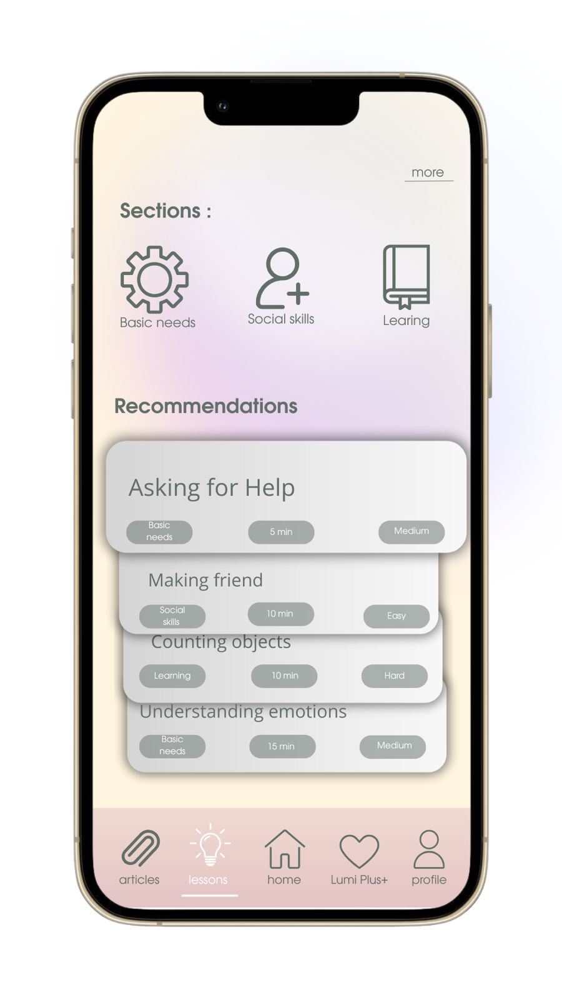
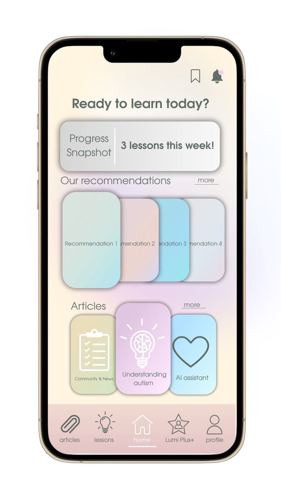

# LumiVerse-AR 🌈

LumiVerse is an AR-based educational platform designed for children with Autism Spectrum Disorder (ASD). Our app uses real-time AI and Unity to deliver personalized social stories that support inclusive learning.

## 🔧 Technologies Used
- Unity + Vuforia (AR engine)
- C# (development)
- AI module for real-time story adaptation (custom-built)
- Visual assets, animations, and child-friendly UI

## 🤝 Collaboration
This project is developed in partnership with:
- Satbayev University
- RPhMS (Republican Physics and Mathematics School)
- SROD (Union of Parents of Special Children)

## 💡 What I Did
- Tech lead and co-founder
- Built and tested the Unity environment
- Integrated AI interaction into the story logic
- Presented the app at **Technovation Girls 2025 (Kazakhstan Finalist)**

## 📸 Screenshots

